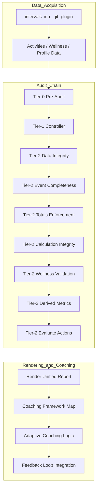

# 📊 Intervals.icu GPT Coaching Framework — v17

A deterministic, rules-based audit and coaching engine for Intervals.icu.  
Implements the **Unified Reporting Framework v5.1**, providing reproducible load validation, physiological audit integrity, and adaptive coaching decisions.

Supports dual execution modes:  
- **Cloud (ChatGPT)** — automated orchestration via GPT-5 using a Worker-gated backend API.  
- **Local Python Execution** — identical logic via `report.py → run_report()`, no cloud dependencies.

---
## 🧭 About [https://www.cliveking.net/]

The **Intervals.icu GPT Coach** transforms athlete data into reproducible, validated insights.  
It operates as an autonomous audit and analytics layer built on the **Unified Reporting Framework v5.1**, ensuring integrity, transparency, and traceability for endurance coaching decisions.  

All computations use **event-only totals** and enforce <2 % variance across all metrics.  
No data smoothing, interpolation, or load-based hour conversions are ever applied. 

##buy me a coffee to support this project!

---

## ⚙️ Core Function

The **primary function** is to transform Intervals.icu athlete data into validated, auditable, and interpretable **coaching intelligence** through a deterministic Tier-structured audit and heuristic mapping layer.

**Functional Sequence:**
1. Fetch → activities, wellness, and profile data.  
2. Audit → execute Tier-0 → Tier-2 checks and tolerance validation.  
3. Compute → generate derived training, recovery, and readiness metrics.  
4. Interpret → map metrics through the Coaching Framework Stack.  
5. Render → output adaptive Markdown report and JSON data payload.

Note: Cloud execution assumes a deterministic, non-sleeping backend runtime.

---

## ⚙️ System Architecture (Full)

| Layer | Module(s) | Function | Description |
|:--|:--|:--|:--|
| **Data Layer** | `intervals_icu__jit_plugin` | Data Acquisition | Fetches activities, wellness, and profile directly from Intervals.icu. |
| **Ruleset Layer** | `all-modules.md` | Rules & Schema | Defines audit dependencies, flow order, and validation gates. |
| **Tier Controller Layer** | `audit_core/report_controller.py` | Tier Routing | Directs Tier-0 → Tier-2 audit chain execution and enforces execution order. |
| **Tier-0 Layer** | `tier0_pre_audit.py` | Initialization | Fetches, cleans, and validates primary data windows. |
| **Tier-1 Layer** | `tier1_controller.py` | Audit Controller | Checks dataset integrity, duplication, and total alignment. |
| **Tier-2 Layer** | `tier2_*` suite | Validation and Metrics | Executes Data Integrity, Totals, Calculation, Wellness, Derived Metrics, and Actions logic. |
| **Derived Metrics Engine** | `tier2_derived_metrics.py` | Metric Computation | Computes ACWR, Strain, Monotony, Fatigue, Recovery, Efficiency, etc. |
| **Adaptive Action Layer** | `tier2_actions.py` | Coaching Logic | Generates adaptive load/recovery/efficiency actions. |
| **Renderer Layer** | `render_unified_report.py` | Markdown Output | Builds full 10-section Unified Report from validated JSON. |
| **Coaching Logic Layer** | `coach_framework-map.md` | Heuristic Context | Links derived metrics to adaptive coaching models. |
| **Framework Stack Layer** | `coach_mapping-table.md` | Framework Integration | Maps metrics to frameworks (Seiler, Banister, Coggan, etc.). |
| **Feedback Integration** | Runtime Loop | Continuous Adaptation | Updates load and readiness patterns for next audit window. |

---

### 🧠 Architecture Flow Diagram

Note: In Cloud (ChatGPT) execution, requests are first routed through a Cloudflare Worker (OAuth, validation, routing) before reaching the audit chain. The diagram below represents the canonical backend audit execution flow.

---

## ☁️ Execution & Hosting Constraints

Cloud execution uses a split model:

- **Edge Gateway (Cloudflare Worker)**  
  Request validation, OAuth, routing only.  
  No audit, aggregation, or metric computation.

- **Backend Engine (FastAPI / Python)**  
  Executes the full Tier-0 → Tier-2 audit and rendering pipeline.

⚠️ Cloud execution requires an **always-on backend container**  
(e.g. Railway or equivalent).
Free / sleeping tiers introduce cold starts and CPU throttling that break
audit determinism and invalidate results.

Local execution is unaffected.

## 🧩 Audit Chain Summary

| Tier | Module | Function | Description |
|:--|:--|:--|:--|
| 0 | `tier0_pre_audit.py` | Pre-Audit | Fetches and validates event and wellness data. |
| 1 | `tier1_controller.py` | Controller | Checks dataset integrity and totals. |
| 2.1 | `tier2_data_integrity.py` | Data Validation | Ensures completeness and source consistency. |
| 2.2 | `tier2_event_completeness.py` | Event Alignment | Identifies rest/current days. |
| 2.3 | `tier2_enforce_event_only_totals.py` | Totals Enforcement | Verifies Σ(event) = Σ(weekly totals). |
| 2.4 | `tier2_calculation_integrity.py` | Integrity Check | Verifies distance/time/TSS variance ≤ 1%. |
| 2.5 | `tier2_wellness_validation.py` | Wellness Validation | Aligns HRV, restHR, and sleep data. |
| 2.6 | `tier2_derived_metrics.py` | Derived Metrics | Computes ACWR, Strain, Polarisation, Efficiency. |
| 2.7 | `tier2_actions.py` | Adaptive Actions | Derives next-step coaching logic. |
| Render | `render_unified_report.py` | Renderer | Builds Unified Framework v5.1 Markdown Report. |

---

## 🧮 Computation Rules

| Metric | Formula | Validation |
|:--|:--|:--|
| **ACWR** | `(EWMA₇d Load / EWMA₂₈d Load)` | Productive: 0.8–1.3 · Overload: >1.5 |
| **Monotony** | `Mean 7-day Load / SD 7-day Load` | Alert: >2.5 (repetitive stress) |
| **Strain** | `Σ(Load) × Monotony` | Overreach: >3500 |
| **Recovery Index** | `(HRV / RestHR) × Readiness` | Optimal ≥ 0.8 · Fatigue < 0.6 |
| **Fatigue Trend** | `Δ(Load₇d – Load₂₈d)` | Balanced −0.2–+0.2 |
| **Readiness** | `(0.3×Mood + 0.3×Sleep + 0.2×Stress + 0.2×Fatigue)` | 0–1 scale |
| **Durability Index** | `1 − (PowerDrop% / 100)` | Robust ≥ 0.9 |
| **Polarisation (Ratio)** | `(Z1 + Z3) / (2 × Z2)` | Optimal 0.75–0.9 (≈80/20) |
| **Polarisation Index (Normalized)** | `(Z1% + Z2%) / Total%` | Aerobic bias ≥ 0.75 |
| **FatOx Efficiency** | `(1 − |IF − 0.7| / 0.1) × (1 − Decoupling / 10)` | Balanced 0.6–0.8 |
| **Consistency Index** | `Sessions Completed / Sessions Planned` | Consistent ≥ 0.9 |
| **Stress Tolerance** | `(Strain / Monotony) / 100` | Sustainable 3–6 |
| **Fatigue Index** | `(7-day Load / RecoveryIndex)` | Alert >2.5 |
| **Specificity Index** | `Race-specific Hours / Total Hours` | Peak Phase 0.7–0.9 |
| **Benchmark Index** | `(FTP_current / FTP_prior) − 1` | Progress +2–5 % |

---

### 🧭 Clarification of Polarisation Terms

| Term | Description | Typical Range | Shown in Report |
|:--|:--|:--|:--|
| **Polarisation (Ratio)** | Seiler 80/20 ratio showing Z1–Z3 vs Z2 balance. | 0.7–1.0 | ✅ Yes (as % e.g. 78 %) |
| **Polarisation Index** | Normalized 0–1 factor showing aerobic vs threshold dominance. | 0.3–0.8 | ✅ Yes |

---

## 🧱 Coaching Framework Stack

The stack integrates **analytical**, **heuristic**, and **behavioral** logic for multi-framework adaptive decision making.

| Layer | Function | Key File |
|:--|:--|:--|
| Tier Engine | Audit Validation | `audit_core/` |
| Derived Metrics | Metric Computation | `tier2_derived_metrics.py` |
| Heuristic Mapping | Rule-based Context | `coach_framework-map.md` |
| Coaching Models | Scientific Foundations | See below |
| Renderer | Markdown Generation | `render_unified_report.py` |
| Feedback Loop | State Adaptation | `runtime/feedback_controller.py` |

---

## 🧭 Coach Framework Model Reference (from `coach_framework-map.md`)

| Model Reference | Framework Link | Metric Source | Output Type | Coaching Role |
|:--|:--|:--|:--|:--|
| **Seiler Polarisation Model** | Polarisation Framework | Zone distribution (Z1–Z3%) | Polarisation Ratio | Intensity distribution validation |
| **Banister Fitness-Fatigue Model** | Load Adaptation | ATL, CTL, TSB | Training Load Model | Predicts adaptation vs fatigue |
| **Coggan Power-Duration Model** | Efficiency Framework | FTP, Power Curve | Efficiency Factor | Tracks metabolic endurance |
| **Foster Overtraining Model** | Recovery Alignment | Strain, Monotony | Overtraining Index | Detects excessive stress |
| **San Millán Metabolic Model** | Metabolic Efficiency | FatOxidationIndex | Mito Efficiency Index | Evaluates fat utilization |
| **Noakes Central Governor Model** | Readiness Forecast | HRV × RPE | CNS Fatigue Index | Detects neural fatigue |
| **Skiba Critical Power Model** | Performance Integration | CP, W' | Fatigue Decay Curve | Predicts limit performance |
| **Mujika Tapering Model** | Periodisation | Load % reduction | Taper Efficiency | Optimizes tapering block |
| **Friel Training Stress Model** | Consistency Framework | TSS, Compliance | Adherence Score | Validates plan execution |
| **Sandbakk-Holmberg Integration** | Action Generation | Multi-framework synthesis | Adaptive Action Score | Generates holistic coaching feedback |

---

## 📚 Documentation Index

Centralized index of all framework, audit, and coaching modules in **Intervals.icu GPT Coaching Framework v16.16G**.  
This section is auto-generated and refreshed via GitHub Actions on commit.

### 🧩 Core Framework Documents
| File | Description |
|:--|:--|
| [all-modules.md](./all-modules.md) | Declarative module manifest consumed at backend startup (via `app.py`) for GitHub JIT loading and dependency validation. |
| [USAGE_GUIDE.md](docs/USAGE_GUIDE.md) | Usage for local execution and Cloud execution (ChatGPT → Worker → backend). |

### 🧱 Coaching Framework Stack
| File | Description |
|:--|:--|
| [coach_framework-map.md](docs/coach_framework-map.md) | Conceptual coaching frameworks and metric-to-action logic (non-executable). |
| [coach_mapping-table.md](docs/coach_mapping-table.md) | Authoritative mapping of audit outputs to coaching frameworks and adaptive actions. |

### 🔬 Analytical & Mapping Resources
| File | Description |
|:--|:--|
| [mapping-table.md](docs/mapping-table.md) | Tier-2 data lineage: raw inputs → derived metrics → Unified Report sections. |

### ⚖️ Governance & Integrity
| File | Description |
|:--|:--|
| [COMPLIANCE_LOG_GUIDE.md](docs/COMPLIANCE_LOG_GUIDE.md) | Compliance logging and audit traceability for backend cloud execution vs local runs. |
| [audit_chain_overview.md](docs/audit_chain_overview.md) | Canonical Tier-0 → Tier-2 audit flow and validation guarantees. |

### 🧭 Entry Points
| File | Function |
|:--|:--|
| `app.py` | **Backend service entry point** (Railway). Initializes runtime and GitHub JIT loading. |
| `report.py` | Primary local execution entry for `run_report()`. |
| `run_audit.py` | Developer diagnostic utility (non-canonical). |
| `audit_core/report_controller.py` | Canonical audit and execution controller (Tier routing authority). |

---

## 📜 References  

- **Seiler, S. & Tønnessen, E. (2009).** *Intervals, Thresholds, and Long Slow Distance: The Role of Intensity and Duration in Endurance Training.* *Eur. J. Sport Sci.*, 9(1), 3–13.  
- **Banister, E. W. (1975).** *Modeling of Training and Overtraining.* *Proc. 1st Int. Symp. Biochem. of Exercise.* Univ. Park Press.  
- **Foster, C. (1998).** *Monitoring Training in Athletes.* *Med. & Sci. Sports Exerc.*, 30(7), 1164–1168.  
- **San Millán, I. (2019).** *Metabolic Flexibility and Mitochondrial Function in Endurance Athletes.* *J. Appl. Physiol.*, 127(5), 1453–1461.  
- **Friel, J. (2012).** *The Triathlete’s Training Bible (4th ed.).* VeloPress.  
- **Sandbakk, Ø. & Holmberg, H. C. (2017).** *Physiological Capacity and Training Routines of Elite Endurance Athletes.* *Scand. J. Med. Sci. Sports*, 27(7), 701–712.  
- **Skiba, P. F. (2014).** *The Application of the Critical Power Model to Cycling.* *Eur. J. Appl. Physiol.*, 114(11), 2441–2453.  
- **Coggan, A. R. & Allen, H. (2010).** *Training and Racing with a Power Meter (2nd ed.).* VeloPress.  
- **Noakes, T. D. (2012).** *The Central Governor Model of Exercise Regulation.* *Wiley-Blackwell.*  
- **Mujika, I. & Padilla, S. (2003).** *Scientific Bases for Pre-Competition Tapering Strategies.* *Med. & Sci. Sports Exerc.*, 35(7), 1182–1187.  
- **Coggan, A. R. & Seiler, S. (2018).** *Hybrid Polarised vs Sweet Spot Endurance Training Analysis.* ACSM Annual Meeting Presentation.

---

**Maintainer:** Intervals ICU GPT Coach Architecture Team  
**Repository:** [revo2wheels/intervalsicugptcoach-public](https://github.com/revo2wheels/intervalsicugptcoach-public)

