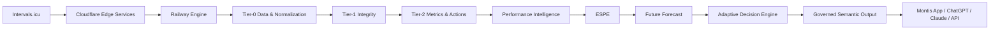

# Montis.icu

**Data access is not coaching intelligence.**

Montis.icu is a deterministic endurance coaching engine built around Intervals.icu data. It validates athlete evidence, resolves physiological and training context through explicit coaching logic, and produces a governed coaching state before conversational AI enters the dialogue.

`Intervals.icu → Montis intelligence → governed athlete state / decision → AI dialogue`

A direct API or MCP connection can expose useful athlete data. Montis adds the missing intelligence layer: longitudinal context, validation, performance behaviour, adaptation progression, phase/event governance and deterministic decision logic.

## Core principle

Montis controls the coaching intelligence. AI explains and discusses the result — it does not independently invent the athlete's training state or coaching decision.

The language model is downstream of the engine. It receives governed semantic output and turns that result into useful conversation across supported interfaces.

## Current architecture

```mermaid
flowchart LR
    ICU[Intervals.icu] --> EDGE[Cloudflare Edge Services]
    EDGE --> ENGINE[Railway Engine]
    ENGINE --> T0[Tier-0 Data & Normalization]
    T0 --> T1[Tier-1 Integrity]
    T1 --> T2[Tier-2 Metrics & Actions]
    T2 --> PI[Performance Intelligence]
    PI --> ESPE[ESPE]
    ESPE --> FORECAST[Future Forecast]
    FORECAST --> ADE[Adaptive Decision Engine]
    ADE --> JSON[Governed Semantic Output]
    JSON --> AI[Montis App / ChatGPT / Claude / API]
```

### Execution entry points

- **Railway:** `app.py` is the backend service entry point and dispatches into `audit_core/report_controller.py`.
- **Local CLI:** `report.py` is the local engineering/report entry point.
- **Engineering Console:** `report_api.py` provides the local engineering API path.
- **Canonical controller:** `audit_core/report_controller.py` executes the deterministic audit and intelligence chain.

`app.py` imports `run_report` directly from `audit_core.report_controller`; the current Railway execution path does not load the historical `all-modules.md` manifest.

## Engine pipeline

The current controller resolves athlete evidence in the following implementation stages:

| Stage | Role | Key modules |
|---|---|---|
| **Tier-0** | Data acquisition, normalization and canonical windows | `audit_core/tier0_pre_audit.py` |
| **Tier-1** | Dataset integrity and audit preparation | `audit_core/tier1_controller.py` |
| **Tier-2** | Event-only totals, derived metrics, extended metrics and deterministic actions | `tier2_*` modules |
| **Tier-3 PI** | Performance Intelligence: durability, repeatability and performance behaviour | `audit_core/tier3_performance_intelligence.py` |
| **Tier-3 ESPE** | Longitudinal energy-system / power-curve progression | `audit_core/tier3_espe.py` |
| **Tier-3 Forecast** | Forward training-load and event context | `audit_core/tier3_future_forecast.py` |
| **Tier-3 ADE** | Adaptive coaching decision and governance | `audit_core/tier3_adaptive_decision_engine.py` |
| **Semantic output** | Assemble the governed machine-readable result | `semantic_json_builder.py` |

Current source versions:

- **Performance Intelligence:** `PI_v1.62`
- **ESPE:** `espe_v1.21`
- **Adaptive Decision Engine:** `ade_v2.21`
- **Unified Reporting Framework:** v5.1

## Montis Intelligence Stack

The product-level intelligence model is intentionally separate from the internal implementation tier names.

1. **Training Load** — recent load, stress pattern and capacity context.
2. **Physiology Response** — recovery, wellness and physiological response to training.
3. **Performance Intelligence** — how capability behaves under real training stress.
4. **Adaptation Progression (ESPE)** — how performance capability changes longitudinally.
5. **Adaptive Decision Engine (ADE)** — current capacity resolved with recovery, phase and event governance into the next coaching decision.

The AI interface is not a sixth intelligence tier. It communicates the governed result.

## Data integrity and authority

Intervals.icu remains the athlete-data authority. Montis validates and structures the available evidence before the coaching intelligence layers operate.

Key implementation principles include:

- event-level totals and explicit validation rather than silent reconstruction;
- explicit handling of missing or degraded evidence;
- separation of computation from language rendering;
- semantic output as the downstream contract for reports and conversational interfaces;
- deterministic coaching logic before LLM interpretation;
- confidence and evidence limits rather than unsupported physiological claims.

## Interfaces

Montis exposes the same governed intelligence through multiple interfaces:

- **Montis App** — browser/PWA interface.
- **ChatGPT** — GPT Actions / Montis integration.
- **Claude and other MCP clients** — through the Montis MCP service.
- **REST/API clients** — structured backend endpoints.
- **Local engineering tools** — CLI and engineering-console execution.

The interfaces can differ in presentation, but they do not become the computational or physiological authority.

## Runtime knowledge resources

Some Markdown files in this repository are operational resources and **must not be renamed, moved or archived as part of documentation cleanup**.

See [`runtime-list.md`](runtime-list.md) for the protected list.

Current protected resources include:

- `tools_mcp.md`
- `workoutsv2.md`
- `question_bank_coaching.md`
- `question_bank_what_next.md`
- `montis_icu_claude_skill_mcp_resource.md`
- `OPENAI/instructionsv17.md`

The first five are Cloudflare Worker MCP knowledge resources. `OPENAI/instructionsv17.md` is the active GPT instruction artifact.

## Documentation

The current documentation index is [`docs/README.md`](docs/README.md).

Key documents:

- [Usage Guide](docs/USAGE_GUIDE.md)
- [Audit Chain Overview](docs/audit_chain_overview.md)
- [Compliance Log Guide](docs/COMPLIANCE_LOG_GUIDE.md)
- [Unified Reporting Framework v5.1](Unified%20Reporting%20Framework.md)
- [Runtime Resource List](runtime-list.md)

Product documentation:

- [Montis.icu](https://www.montis.icu/)
- [Science](https://www.montis.icu/science.html)
- [Technical Design](https://www.montis.icu/pipeline.html)
- [Public repository](https://github.com/revo2wheels/intervalsicugptcoach-public)

## Legacy architecture material

The repository still contains some historical artifacts from the pre-Railway GPT/JIT architecture. In particular:

- `all-modules.md` was the earlier GPT/JIT module manifest.
- `api_github_com__jit_plugin/` is a compatibility shim that wraps `all-modules.md` in the old GitHub-content response shape.

The current `app.py`, `report.py`, `report_api.py` and `audit_core` execution paths do not reference `all-modules.md`, `loadAllRules` or `api_github_com__jit_plugin`. These artifacts should therefore be treated as legacy cleanup candidates rather than current architecture.

Several older documents under `docs/` also describe the former Tier-0 → Tier-2-only model. They are retained until reviewed or archived and should not override the current architecture described here and in `docs/README.md`.

## Support

If Montis.icu is useful to you, you can support the project through [Buy Me a Coffee](https://www.buymeacoffee.com/revo2wheels).

## License

The software in this repository is licensed under the [MIT License](LICENSE).

See [NOTICE.txt](NOTICE.txt) for the distinction between the software license and Montis.icu names, branding, logos, hosted services and service identifiers.

Copyright © 2026 Clive King.
