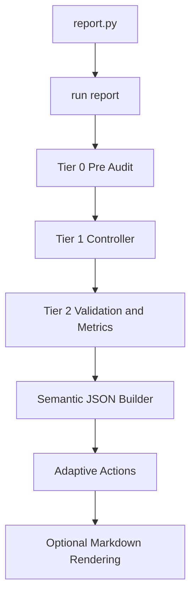

# Audit Chain Overview — v17

## Overview

This document describes the **canonical audit execution flow** of the Intervals.icu GPT Coaching Framework.
It outlines the Tier-0 → Tier-2 audit chain and clarifies how execution differs between
**Cloud execution (ChatGPT-orchestrated, backend-executed)** and **Local Python execution**.

This document defines **execution semantics**, not conceptual coaching logic.

---

## Cloud Execution (Authoritative)

**Execution model:** ChatGPT → Cloudflare Worker → Backend API  
**Audit authority:** Backend runtime (FastAPI / Python)

In Cloud execution, **ChatGPT does not execute audits, fetch modules, or render reports**.
All audit logic runs in the backend runtime.

### Cloud Audit Flow

1. ChatGPT issues a report intent (e.g. `weekly`, `season`).
2. Request is routed through the **Cloudflare Worker**:
   - OAuth token exchange
   - Request validation
   - Routing to backend
3. Backend entry point (`app.py`) receives the request.
4. `run_report()` in `audit_core/report_controller.py` is invoked.
5. `run_report()` orchestrates the full audit chain:
   - **Tier-0 — Pre-Audit**
     - Data window validation
     - Athlete profile, activities, wellness fetch
   - **Tier-1 — Dataset Integrity**
     - Duplication checks
     - Dataset consistency validation
   - **Tier-2 — Validation & Metrics**
     - Data integrity checks
     - Event completeness
     - Event-only totals enforcement
     - Calculation integrity (variance enforcement)
     - Wellness validation
     - Derived metrics computation
     - Adaptive action evaluation
6. Outputs are assembled into a **semantic JSON audit object**.
7. Optional Markdown rendering may be generated **from semantic JSON**.
8. Semantic JSON (and optional rendered output) is returned via the API.

**Important:**
- No audit logic runs in ChatGPT or the Worker.
- JSON is the **canonical audit artifact**.
- Rendering is downstream and optional.

---

## Local Execution (Python)

**Execution model:** Direct Python runtime  
**Audit authority:** Local process

Local execution mirrors Cloud execution **exactly**, without orchestration layers.

### Local Audit Flow

1. `report.py` invokes `run_report()` from `audit_core/report_controller.py`.
2. `run_report()` orchestrates the identical Tier-0 → Tier-2 audit chain.
3. Semantic JSON audit output is assembled.
4. Optional Markdown rendering is generated from JSON.
5. Outputs are written to disk.

**Artifacts:**
- `/output/report.json` — canonical semantic audit output
- `/output/report.md` — rendered presentation (optional)
- `/logs/compliance.log` — compliance trace (optional)

A developer utility, `run_audit.py`, may invoke individual tiers for diagnostics.
It is **non-canonical** and not used for standard reporting.

---

## Local Execution Flow Diagram

## Key Differences Between Cloud and Local Execution

| Feature | Cloud Execution | Local Execution |
|:--|:--|:--|
| Orchestration | ChatGPT → Worker | None |
| Audit Execution | Backend runtime | Local Python |
| Entry Point | `app.py` → `run_report()` | `report.py` → `run_report()` |
| Canonical Output | Semantic JSON | Semantic JSON |
| Rendering | Optional, derived | Optional, derived |
| Determinism | Enforced | Enforced |

## Conclusion

The audit chain is **single, deterministic, and canonical** across all environments.

- Tier-0 → Tier-2 always execute in the same order  
- Semantic JSON is the source of truth  
- Rendering is never authoritative  
- ChatGPT orchestrates but does not compute  

Any execution model that violates these constraints is **non-compliant**.

---

