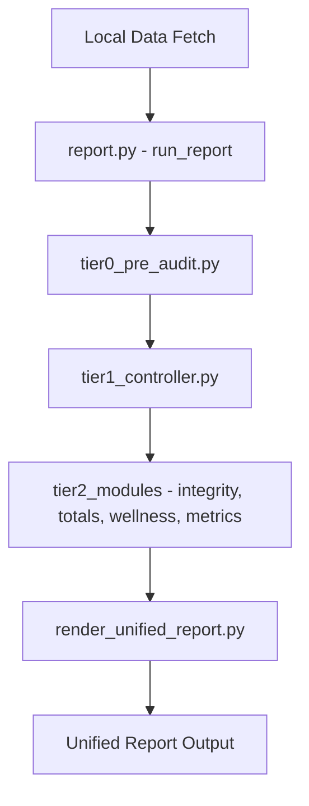

# Audit Chain Overview

## Overview
This document outlines the step-by-step flow of the audit process, starting from **Tier-0** and progressing through **Tier-2** modules. It also details how the audit process differs between **ChatGPT Cloud Mode** and **Local Python Execution Mode**.

## ChatGPT (Cloud) Execution Flow
In **Cloud Mode**, ChatGPT orchestrates the entire audit process. This is done by fetching modules from the GitHub repository via raw URLs, parsing them, and executing them as per the audit rules.

### Flow in ChatGPT Mode
1. **run_report()** in `audit_core/report_controller.py` is invoked to begin the report generation process.
2. This calls **run_audit()**, which triggers the following sequence:
   - **Tier-0: run_tier0_pre_audit()** — Collects athlete context, activities, and wellness data.
   - **Tier-1: run_tier1_controller()** — Validates data integrity.
   - **Tier-2: Various validation functions** — Ensures dataset completeness, enforces event-only totals, checks for calculation integrity, computes derived metrics, evaluates actions, and validates render readiness.
3. The entire process is automated in the **ChatGPT environment**, where outputs are processed through the `render_unified_report.py` file, resulting in a comprehensive 10-section Markdown report.

## Local Execution Flow
In **Local Python Mode**, the audit is executed manually through the CLI using **report.py**.  
This file serves as the official local entry point and calls `run_report()` from  
`audit_core/report_controller.py`, invoking the same Tier-0 → Tier-2 audit chain used in Cloud Mode.

### Flow in Local Mode
1. `report.py` imports and executes `run_report()`, which orchestrates all audit tiers.
2. Each Tier module (Tier-0 through Tier-2) is run locally using identical logic to the Cloud controller.
3. Outputs are written to `/output/report.json` and `/output/report.md`.
4. A diagnostic script, **run_audit.py**, remains available for developer testing and direct tier calls but is **not** used for standard reporting.

### Local Mode Flow Diagram

```mermaid
graph TB
    A[Local Data Fetch] --> B[report.py - run_report]
    B --> C[tier0_pre_audit.py]
    C --> D[tier1_controller.py]
    D --> E[tier2_modules - integrity, totals, wellness, metrics]
    E --> F[render_unified_report.py]
    F --> G[Unified Report Output]
```
## Key Differences Between Cloud and Local Flows
| Feature | Cloud (ChatGPT) | Local (Python) |
|:--|:--|:--|
| Execution | ChatGPT orchestrates | Local CLI runs `run_audit.py` |
| Entry Point | `run_report()` calls `run_audit()` via `report_controller.py` | `run_audit.py` directly imports and calls modules |
| Report Generation | Automated via `render_unified_report.py` | Manual render via `run_audit.py` or `report.py` |
| Data Fetching | Data fetched from cloud APIs (via `intervals_icu__jit_plugin`) | Data loaded from local APIs or cached storage |

## Conclusion
This audit flow provides a seamless method for both cloud-based and local-based execution of the audit process, ensuring flexibility for remote and offline use.

---

