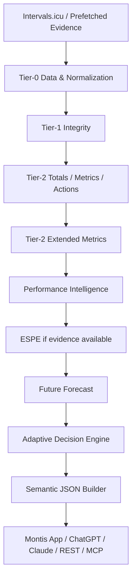

# Audit & Intelligence Chain Overview

## Overview

This document describes the current canonical execution flow of the Montis.icu coaching engine.

The backend no longer ends at Tier-2. Tier-0 through Tier-2 establish validated data, metrics and deterministic actions; the controller then executes Tier-3 intelligence modules before semantic output is assembled.

The implementation chain and the product-level five-layer Montis Intelligence Stack are related but not identical concepts.

## Canonical backend authority

**Railway entry point:** `app.py`  
**Execution authority:** `audit_core/report_controller.py`  
**Semantic assembly:** `semantic_json_builder.py`

`app.py` imports `run_report()` directly from `audit_core.report_controller`.

The current backend execution path does not depend on the historical `all-modules.md` / GitHub JIT manifest model.

## Cloud execution

Typical cloud flow:

`Client → Cloudflare Edge Services → Railway app.py → report_controller.py → semantic output → client`

Cloudflare provides the edge/integration layer. Depending on the interface it can handle authentication, OAuth, request validation, routing, prefetch/integration work and MCP resources.

The Railway backend remains the authority for canonical coaching computation and decision resolution.

## Current execution chain

### Tier-0 — data acquisition and normalization

`tier0_pre_audit.py` establishes the athlete context and canonical data windows. The controller preserves recent high-resolution activity data and broader light/chronic data for downstream modules.

Typical evidence includes:

- athlete profile;
- recent/full activities;
- longer-range activity history;
- wellness;
- calendar/event context;
- power-curve data when supplied.

### Tier-1 — dataset integrity

`tier1_controller.py` validates and prepares the data for analysis, preserving the context required by later stages.

### Tier-2 — metrics, integrity and deterministic actions

Tier-2 performs the core audit and derived-metric work, including:

- event completeness;
- event-only totals enforcement;
- calculation/wellness validation;
- derived metrics;
- deterministic actions;
- extended metrics and additional analytical context.

Tier-2 is therefore a foundation of the current engine, but it is no longer the final coaching-intelligence stage.

### Tier-3 — Performance Intelligence

`tier3_performance_intelligence.py` evaluates performance behaviour using recent and, where appropriate, chronic evidence.

Current source version: `PI_v1.62`.

### Tier-3 — ESPE

`tier3_espe.py` runs the Energy System Progression Engine when the required power-curve evidence is available.

Current source version: `espe_v1.21`.

If the required power-curve block is absent, ESPE is skipped rather than inventing progression evidence.

### Tier-3 — Future Forecast

`tier3_future_forecast.py` resolves forward load/event context used by later decision governance.

### Tier-3 — Adaptive Decision Engine

`tier3_adaptive_decision_engine.py` resolves the adaptive coaching decision using the available state together with phase, recovery and event context.

Current source version: `ade_v2.21`.

### Semantic output

After the intelligence chain has executed, `semantic_json_builder.py` assembles the governed semantic result for downstream reporting and conversational interfaces.

The language model is downstream of this process. It can explain and discuss the result; it does not replace the deterministic engine as the authority for athlete state or coaching decision.

## Flow diagram

```mermaid
flowchart TD
    A[Intervals.icu / Prefetched Evidence] --> B[Tier-0 Data & Normalization]
    B --> C[Tier-1 Integrity]
    C --> D[Tier-2 Totals / Metrics / Actions]
    D --> E[Tier-2 Extended Metrics]
    E --> F[Performance Intelligence]
    F --> G[ESPE if evidence available]
    G --> H[Future Forecast]
    H --> I[Adaptive Decision Engine]
    I --> J[Semantic JSON Builder]
    J --> K[Montis App / ChatGPT / Claude / REST / MCP]
```

## Product intelligence model

The implementation chain above should not be confused with the five product-level coaching layers:

1. Training Load
2. Physiology Response
3. Performance Intelligence
4. Adaptation Progression (ESPE)
5. Adaptive Decision Engine (ADE)

Those five layers describe how Montis resolves coaching intelligence. Tier-0/Tier-1/Tier-2/Tier-3 describe how the software implements and validates that process.

## Local engineering execution

Local engineering entry points are `report.py` and `report_api.py`. They should converge on the same `audit_core/report_controller.py` logic rather than maintaining a separate interpretation engine.

## Legacy note

The following belong to the earlier pre-Railway GPT/JIT architecture and are not part of the current canonical execution path:

- `all-modules.md`
- `api_github_com__jit_plugin/`
- `loadAllRules`

Historical documents that describe Tier-0 → Tier-2 as the entire canonical coaching chain should be treated as superseded unless updated to include the current Tier-3 intelligence stages.

## Related documentation

- [Documentation Index](README.md)
- [Usage Guide](USAGE_GUIDE.md)
- [Compliance Log Guide](COMPLIANCE_LOG_GUIDE.md)
- [Unified Reporting Framework](../Unified%20Reporting%20Framework.md)
