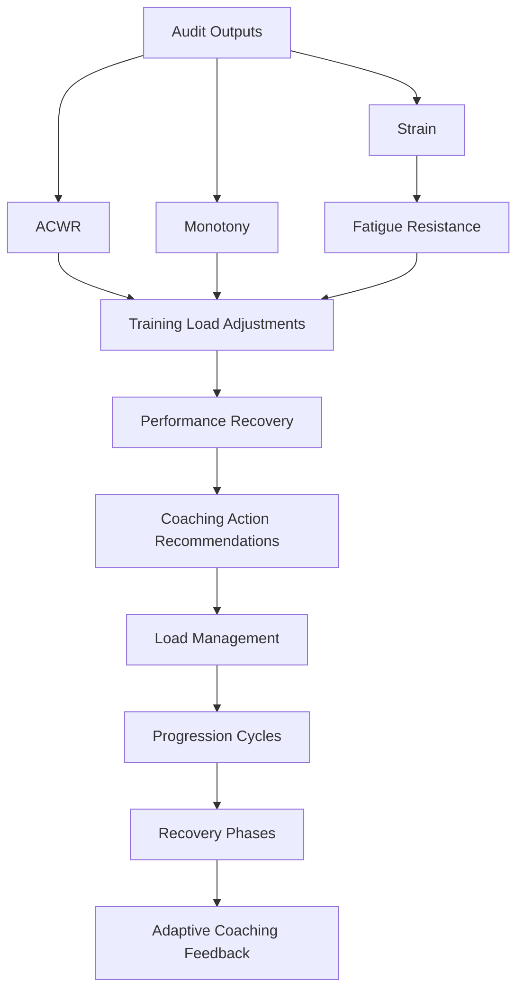

# Coach Mapping Table — v17

## Overview

This table provides the **authoritative semantic mapping** between audit modules,
derived metrics, and coaching frameworks used in the **Intervals.icu GPT Coaching Framework**.

All metrics and actions listed here are emitted into the **semantic JSON audit output**.
Markdown rendering and presentation layers consume this JSON and are not sources of truth.

---

## Audit and Coaching Modules (Semantic Roles)

| Module / Function | Source File | Frameworks Involved | Semantic Role |
|:--|:--|:--|:--|
| **run_tier0_pre_audit()** | `audit_core/tier0_pre_audit.py` | All | Initializes audit context and validates input windows |
| **run_tier1_controller()** | `audit_core/tier1_controller.py` | Banister, Foster | Dataset integrity and duplication checks |
| **validate_data_integrity()** | `audit_core/tier2_data_integrity.py` | All | Dataset consistency and source validation |
| **validate_event_completeness()** | `audit_core/tier2_event_completeness.py` | All | Rest day / current day semantic classification |
| **enforce_event_only_totals()** | `audit_core/tier2_enforce_event_only_totals.py` | All | Canonical event-only totals |
| **validate_calculation_integrity()** | `audit_core/tier2_calculation_integrity.py` | All | Variance and tolerance enforcement |
| **compute_derived_metrics()** | `audit_core/tier2_derived_metrics.py` | Seiler, Banister, San Millán | Emits canonical load, fatigue, intensity, durability metrics |
| **compute_extended_metrics()** | `audit_core/tier2_extended_metrics.py` | Friel, Skiba | Emits extended performance and metabolic metrics |
| **evaluate_actions()** | `audit_core/tier2_actions.py` | All | Generates adaptive coaching actions |
| **run_report()** | `audit_core/report_controller.py` | All | Orchestrates Tier-0 → Tier-2 and semantic assembly |
| **semantic_json_builder** | internal | All | Assembles canonical semantic audit output |
| **coach_profile()** | `coaching_profile.py` | All | Contextualizes actions using athlete profile |
| **coaching_heuristics()** | `coaching_heuristics.py` | All | Applies rule-based coaching thresholds |
| **coaching_cheat_sheet()** | `coaching_cheat_sheet.py` | All | Lookup-based decision support |

---

## 🧩 Derived Metrics

| Coaching Framework | Semantic Metrics / Fields | Producing Modules |
|:--|:--|:--|
| **Seiler 80/20 Polarisation** | `intensity.polarisation_ratio`, `intensity.polarisation_index`, `sessions.quality_balance` | `tier2_derived_metrics.py`, `tier2_render_validator.py` |
| **Banister Fitness–Fatigue (TRIMP / ACWR)** | `load.acwr`, `load.strain`, `load.trimp`, `load.fatigue_trend` | `tier2_derived_metrics.py`, `tier2_actions.py` |
| **Foster Monotony / Strain** | `load.monotony`, `load.strain`, `load.stress_tolerance` | `tier2_derived_metrics.py` |
| **San Millán Metabolic Flexibility** | `metabolic.fat_oxidation_index (FOxI)`, `metabolic.fatox_efficiency`, `metabolic.cur`, `metabolic.gr`, `metabolic.mes` | `tier2_extended_metrics.py`, `tier2_derived_metrics.py` |
| **Friel Periodisation & Recovery Logic** | `context.phase`, `context.endurance_reserve`, `context.fatigue_index`, `context.readiness`, `context.recovery_index` | `tier2_extended_metrics.py`, `tier2_actions.py`, `coaching_profile.py` |
| **Sandbakk Durability** | `performance.durability_index`, `efficiency_drift`, `z2_stability` | `tier2_extended_metrics.py`, `tier2_actions.py` |
| **Skiba Critical Power (CP / W′)** | `performance.cp`, `performance.wprime`, `performance.depletion_rate` | `tier2_extended_metrics.py` |
| **Coggan Power Zones** | `zones.power_z1–z7`, `zones.hr_z1–z7`, `zones.intensity_distribution` | `tier2_render_validator.py` |
| **Noakes Central Governor (Recovery & Readiness)** | `recovery.index`, `readiness.score`, `fatigue_trend`, `wellness.integration` | `tier2_extended_metrics.py`, `tier2_actions.py` |

---

## Action Semantics

Adaptive actions are emitted as structured semantic objects:

- `actions.load_adjustment`
- `actions.recovery_emphasis`
- `actions.intensity_shift`
- `actions.periodisation_hint`

Actions are:
- derived from audit flags and semantic metrics
- deterministic
- independent of rendering or UI

---

## Conclusion
This **Mapping Table** provides a comprehensive view of all the key modules, functions, and derived metrics used in the **IntervalsICU GPT Coach** system. It highlights how different **audit outputs** from **Tier-2 modules** influence **coaching decisions** and provide the basis for **adaptive training actions** in various frameworks.

---
This diagram represents the conceptual coaching logic derived from semantic audit outputs. It does not correspond to a runtime execution graph.

