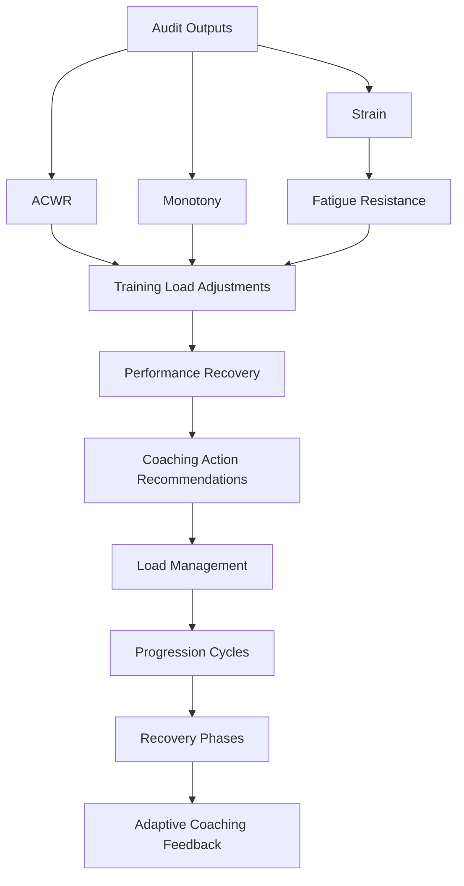

# Mapping Table

## Overview
This table provides an authoritative reference for all modules, functions, and derived metrics used in the **IntervalsICU GPT Coach** system. It lists the associated **coaching frameworks** and describes how audit outputs and derived markers are computed and utilized in the decision-making process.

---

## Audit and Coaching Modules

| Module / Function Name               | Source File                   | Coaching Framework(s) Involved           | Purpose / Role |
|:-------------------------------------|:-------------------------------|:----------------------------------------|:---------------|
| **run_tier0_pre_audit()**            | `audit_core/tier0_pre_audit.py` | Seiler 80/20 Polarization, Banister TRIMP | Fetches athlete data and initializes the audit chain |
| **run_tier1_controller()**           | `audit_core/tier1_controller.py`| Banister TRIMP, Foster Monotony/Strain   | Validates dataset integrity and prepares data for tier-2 checks |
| **validate_data_integrity()**        | `audit_core/tier2_data_integrity.py` | All Frameworks                        | Ensures data consistency and integrity, checks for duplicates |
| **validate_event_completeness()**    | `audit_core/tier2_event_completeness.py` | All Frameworks                         | Ensures no missing or duplicate events |
| **enforce_event_only_totals()**      | `audit_core/tier2_enforce_event_only_totals.py` | All Frameworks                         | Aggregates event-level totals to ensure consistent data |
| **validate_calculation_integrity()** | `audit_core/tier2_calculation_integrity.py` | All Frameworks                         | Ensures calculation accuracy (e.g., variance checks) |
| **compute_derived_metrics()**        | `audit_core/tier2_derived_metrics.py` | Banister TRIMP, Seiler 80/20 Polarization, San Millán Metabolic Flexibility | Computes **ACWR**, **Strain**, **Monotony**, and other key derived metrics |
| **compute_extended_metrics()**       | `audit_core/tier2_extended_metrics.py` | Banister TRIMP, Friel Periodisation    | Computes **Wprime**, **FatOxidationIndex**, and extended training metrics |
| **evaluate_actions()**               | `audit_core/t2_actions.py`    | Banister TRIMP, Foster Monotony/Strain   | Evaluates actions and adaptive coaching responses based on **ACWR**, **Strain**, **Monotony** |
| **run_report()**                     | `audit_core/report_controller.py` | All Frameworks                         | Controls the overall report flow and triggers the audit process |
| **coach_profile()**                  | `coaching_profile.py`         | All Frameworks                         | Provides context for coaching actions and strategy based on metrics |
| **coaching_heuristics()**            | `coaching_heuristics.py`      | All Frameworks                         | Uses heuristics to adjust training phases based on audit outputs |
| **coaching_cheat_sheet()**           | `coaching_cheat_sheet.py`     | All Frameworks                         | Assists in decision-making for specific training load adjustments |
| **FatOxidationIndex**                | `derived_metrics.py`          | San Millán Metabolic Flexibility       | Derived from aerobic training intensity, used to assess metabolic efficiency |
| **PolarisationIndex**                | `derived_metrics.py`          | Seiler 80/20 Polarization              | Derived from **low-intensity vs. high-intensity** distribution, key to the **80/20** model |

---

## Coaching Framework Specifics

| Coaching Framework Name               | Key Derived Markers / Metrics                          | Relevant Modules / Functions |
|:--------------------------------------|:------------------------------------------------------|:-----------------------------|
| **Seiler 80/20 Polarization**         | **PolarisationIndex**, **QualitySessionBalance**      | `derived_metrics.py`, `tier2_event_completeness.py`, `coaching_heuristics.py` |
| **Banister TRIMP**                    | **ACWR**, **Strain**, **TRIMP (Training Load)**       | `tier1_controller.py`, `t2_actions.py`, `derived_metrics.py` |
| **Foster Monotony and Strain**       | **Monotony**, **Strain**, **Training Intensity Variability** | `tier2_calculation_integrity.py`, `coaching_heuristics.py`, `coaching_cheat_sheet.py` |
| **San Millán Metabolic Flexibility** | **FatOxidationIndex**, **Aerobic Threshold**, **Metabolic Flexibility Index** | `derived_metrics.py`, `coaching_profile.py` |
| **Friel Periodisation**               | **ACWR**, **Monotony**, **Peak Load**, **Recovery Readiness** | `tier1_controller.py`, `coaching_profile.py`, `coaching_heuristics.py` |
| **Skiba Critical Power**              | **Wprime**, **Critical Power**, **Wprime Depletion Rate** | `extended_metrics.py`, `coaching_profile.py` |

---

## Conclusion
This **Mapping Table** provides a comprehensive view of all the key modules, functions, and derived metrics used in the **IntervalsICU GPT Coach** system. It highlights how different **audit outputs** from **Tier-2 modules** influence **coaching decisions** and provide the basis for **adaptive training actions** in various frameworks.

---

```mermaid
graph TD
    A[Audit Outputs] --> B[ACWR]
    A --> C[Monotony]
    A --> D[Strain]
    B --> E[Training Load Adjustments]
    C --> E
    D --> F[Fatigue Resistance]
    F --> E
    E --> G[Performance Recovery]
    G --> H[Coaching Action Recommendations]
    H --> I[Load Management]
    I --> J[Progression Cycles]
    J --> K[Recovery Phases]
    K --> L[Adaptive Coaching Feedback]

```