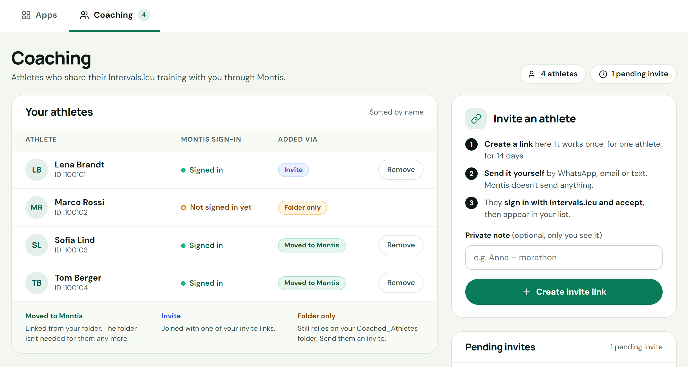
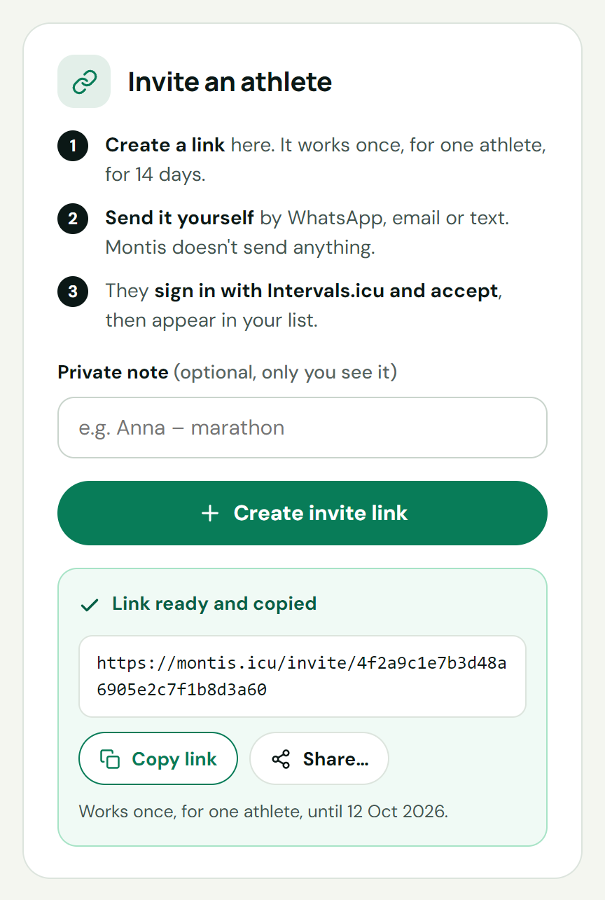
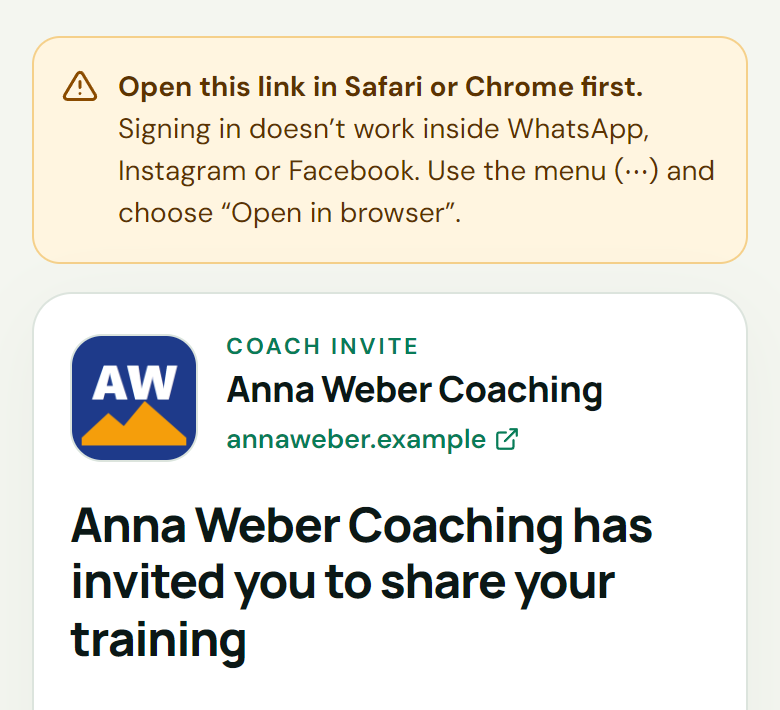
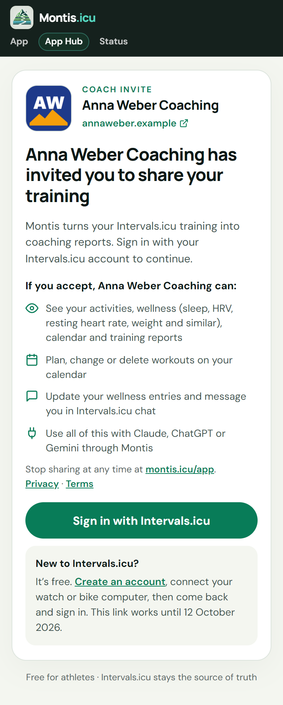
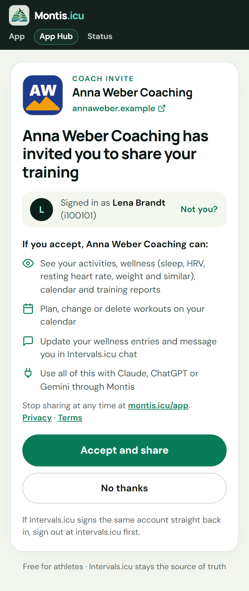
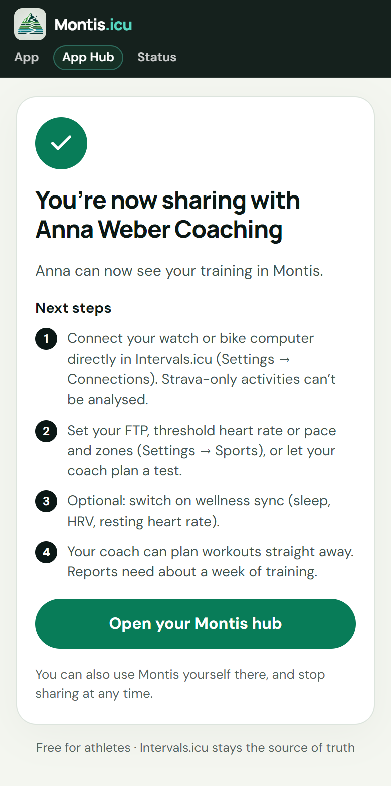
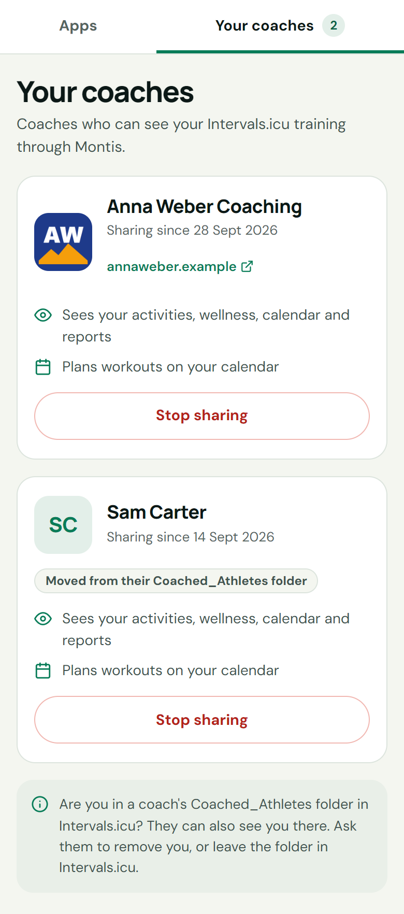
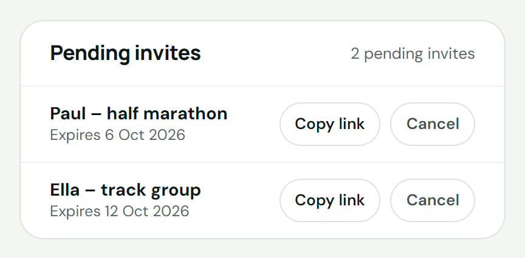
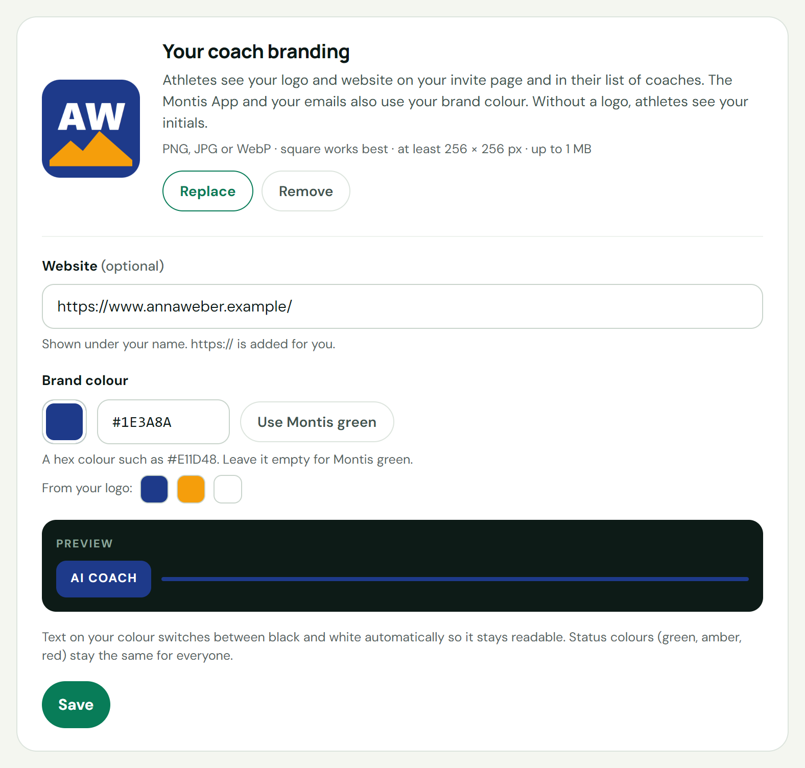
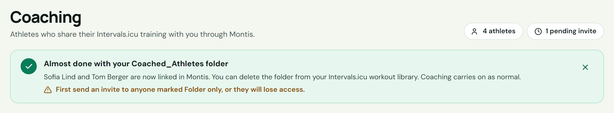

# Coaching athletes with Montis.icu

Coaches add athletes to Montis with a one-time invite link. The athlete opens the link, signs in with Intervals.icu and accepts. The coach can then work with that athlete's training in ChatGPT, Claude and the Montis App.

Invite links replace the old `Coached_Athletes` folder in Intervals.icu. If you used the folder, see [Moving from the Coached_Athletes folder](#moving-from-the-coached_athletes-folder).

- [What it is](#what-it-is)
- [Who needs what](#who-needs-what)
- [For coaches: invite an athlete](#for-coaches-invite-an-athlete)
- [For athletes: accept an invite](#for-athletes-accept-an-invite)
- [Managing your athletes](#managing-your-athletes)
- [Coach branding (optional)](#coach-branding-optional)
- [Moving from the Coached_Athletes folder](#moving-from-the-coached_athletes-folder)
- [Privacy and control](#privacy-and-control)
- [Troubleshooting](#troubleshooting)
- [Where to use your athletes](#where-to-use-your-athletes)

## What it is

1. The coach creates an invite link in the Montis hub at [https://montis.icu/app](https://montis.icu/app), on the **Coaching** tab.
2. The coach sends the link to one athlete, by WhatsApp, email or text. Montis doesn't send anything.
3. The athlete opens the link, signs in with Intervals.icu and presses **Accept and share**.
4. The athlete appears in the coach's list. The coach can now see their training and plan workouts through Montis.

Invite links look like this:

```text
https://montis.icu/invite/<code>
```

Each link works once, for one athlete, for 14 days. Intervals.icu stays the source of truth. The coach can reach the athlete's Intervals.icu data through Montis only while the athlete shares it. Either side can end the sharing at any time.

## Who needs what

| | Coach | Athlete |
|---|---|---|
| Montis membership | An active **Montis Subscriber** membership | None. Montis is free for athletes |
| Intervals.icu account | Yes | Yes. A free account is fine |
| Email | Your Intervals.icu account email must match your membership email | Nothing to match |

- The Subscriber membership is on Buy Me a Coffee: [https://buymeacoffee.com/revo2wheels/membership](https://buymeacoffee.com/revo2wheels/membership). A one-off Supporter payment doesn't include coaching.
- Montis finds your membership by email. If your Intervals.icu email and your membership email differ, Montis can't see your membership and you can't create invites.
- Only the coach pays. The hub says it like this: "Only you need a Subscriber membership. Athletes use Montis free, and can stop sharing at any time from their hub."

## For coaches: invite an athlete

### 1. Open the Coaching tab

- Open [https://montis.icu/app](https://montis.icu/app).
- If you aren't signed in, press **Connect Intervals** and approve access in Intervals.icu.
- Open the **Coaching** tab. It shows **Your athletes** on the left and **Invite an athlete** on the right.

The **Coaching** tab only appears when you can create invites or already have athletes. If you don't see it, check your membership (see [Who needs what](#who-needs-what)).



### 2. Create an invite link

- In **Invite an athlete**, add a **Private note** if you like. Only you see it, for example `Paul – half marathon`. It can be up to 60 characters.
- Press **Create invite link**.
- The panel shows **Link ready and copied**. The link is already on your clipboard.
- Press **Copy link** to copy it again. On phones and some browsers, **Share…** opens your device's share sheet.
- If your browser blocks copying, a **Copy this link** box shows the link selected. Copy it with Ctrl+C (Cmd+C on a Mac) and press **Done**.



### 3. Send the link yourself

- Send the link to one athlete, by WhatsApp, email or text.
- Montis doesn't send anything.
- Each link works once, for one athlete, until the date shown under the link (14 days).
- Create one link per athlete. For a group, create a link for each person.

### 4. See the athlete in your list

- When the athlete accepts, reload the hub page. The athlete appears in **Your athletes** with the badge **Invite** and the status **Signed in**.
- Until then, the link is listed under **Pending invites**.

## For athletes: accept an invite

Your coach sends you a link that starts with `https://montis.icu/invite/`. Accepting is free.

### 1. Open the link in your browser

Open the link in Safari or Chrome. Signing in doesn't work inside WhatsApp, Instagram or Facebook. If the link opens there, the page shows an amber notice. Use the menu (⋯) and choose **Open in browser**.



### 2. Check who invited you and sign in

- The page shows your coach's name, and their logo and website if they added them.
- Under **If you accept, [coach] can:** it lists what your coach can do. See [Privacy and control](#privacy-and-control).
- Press **Sign in with Intervals.icu** and approve access in Intervals.icu.
- New to Intervals.icu? It's free. Create an account at [intervals.icu](https://intervals.icu), connect your watch or bike computer, then come back to the link and sign in. The page shows the date the link works until.



### 3. Accept and share

- The page now says **Signed in as** with your name and Intervals.icu ID.
- Wrong account? Press **Not you?** to sign out. If Intervals.icu signs the same account straight back in, sign out at intervals.icu first.
- Press **Accept and share**. Or press **No thanks** to leave without sharing anything.



### 4. Next steps

The page confirms that you're now sharing with your coach, then lists four next steps:

1. Connect your watch or bike computer directly in Intervals.icu (**Settings → Connections**). Strava-only activities can't be analysed.
2. Set your FTP, threshold heart rate or pace and zones (**Settings → Sports**), or let your coach plan a test.
3. Optional: switch on wellness sync (sleep, HRV, resting heart rate).
4. Your coach can plan workouts straight away. Reports need about a week of training.

Press **Open your Montis hub** to see your coaches. You can also use Montis yourself there, and stop sharing at any time.



### 5. Your coaches in the hub

Your coaches are listed on the **Your coaches** tab at [https://montis.icu/app](https://montis.icu/app). Each card shows the coach, the date you started sharing and what they can do. **Stop sharing** ends it.



## Managing your athletes

### Your athletes

The list is sorted by name. It has three columns.

**Montis sign-in**

- **Signed in**: Montis can read this athlete's Intervals.icu data.
- **Not signed in yet**: the athlete is on your list, but Montis can't read their data yet. Ask them to sign in at [https://montis.icu/app](https://montis.icu/app) with Intervals.icu. You also see this after an athlete presses **Disconnect apps** in their hub.

**Added via**

| Badge | Meaning |
|---|---|
| **Invite** | Joined with one of your invite links. |
| **Moved to Montis** | Linked from your folder. The folder isn't needed for them any more. |
| **Folder only** | Still relies on your `Coached_Athletes` folder. Send them an invite. |

**Remove**

- Press **Remove** next to an athlete. Montis asks "Remove [name]?" and explains: "You will no longer be able to see their data in Montis."
- Press **Remove** to confirm.
- Nothing changes in the athlete's Intervals.icu account.
- To work together again, send them a new invite.
- **Folder only** athletes have no **Remove** button. Take them out of your `Coached_Athletes` folder in Intervals.icu instead.

### Pending invites

Invites that nobody has accepted yet are listed under **Pending invites**, with your private note and the expiry date.

- **Copy link** copies the link again.
- **Cancel** stops the link working. Montis asks "Cancel this invite?". Press **Cancel invite** to confirm, or **Keep invite**. You can create a new one at any time.
- An invite leaves the list when it is accepted, cancelled or expires.



### Limits

- Up to 20 pending invites at a time.
- Up to 50 athletes linked through Montis.

### If your membership stops

If your Subscriber membership isn't active, coaching pauses:

- The hub says how many "invited athlete(s) are paused because your Montis Subscriber membership isn't active."
- Athletes who open one of your invites see "Coaching isn't active right now".
- You can't open coached athletes in ChatGPT, Claude or the Montis App.

When your membership is active again, your athletes come back. Nothing is deleted.

## Coach branding (optional)

Add your logo, website and brand colour in **Your coach branding** on the **Coaching** tab.

- **Logo.** Press **Upload image** (later **Replace**). PNG, JPG or WebP · square works best · at least 256 × 256 px · up to 1 MB. **Remove** takes it away.
- **Website (optional).** Shown under your name. https:// is added for you.
- **Brand colour.** Type a hex colour such as `#E11D48`, or press the swatch to pick one. **From your logo:** suggests colours taken from your logo. **Use Montis green** goes back to the default.
- **Preview** shows a button in your colour. Text on your colour switches between black and white automatically so it stays readable. Status colours (green, amber, red) stay the same for everyone.
- Press **Save** for the website and colour. The logo is saved when you upload it.

Where it shows:

- Athletes see your logo and website on your invite page and in their list of coaches.
- The Montis App and your emails also use your brand colour.
- Without a logo, athletes see your initials.



## Moving from the Coached_Athletes folder

Before invite links, coaches shared a private `Coached_Athletes` folder in Intervals.icu. Montis now keeps its own list, so the folder is no longer needed.

- **Moved automatically.** When invites started for your account, Montis moved everyone already shared in your folder into Montis, once. They show **Moved to Montis**. They don't need to accept an invite. In their hub, your card says "Moved from their Coached_Athletes folder".
- **Folder only.** Athletes added to the folder after that move were not moved. They show **Folder only** and still rely on the folder. Send each of them an invite.
- **The banner.** The **Coaching** tab shows a banner that tells you when the folder can go:
  - "Almost done with your Coached_Athletes folder" while anyone is still **Folder only**. It adds: "First send an invite to anyone marked Folder only, or they will lose access."
  - "Your Coached_Athletes folder isn't needed any more" when nobody is **Folder only**.
- **Delete the folder** from your Intervals.icu workout library once nobody is marked **Folder only**. The banner tells you when. Coaching carries on as normal.
- The banner only says the folder can go when Montis could check your whole list.
- The close (X) button hides the banner for good in that browser. If you closed it, check your list instead: the folder can go once nobody is marked **Folder only**.



## Privacy and control

### What the coach can do

The invite page lists exactly what the athlete agrees to. If the athlete accepts, the coach can:

- See their activities, wellness (sleep, HRV, resting heart rate, weight and similar), calendar and training reports.
- Plan, change or delete workouts on their calendar.
- Update their wellness entries and message them in Intervals.icu chat.
- Use all of this with Claude, ChatGPT or Gemini through Montis.

### What stays private

- **Athletes never see each other.** An athlete sees only their own coaches. They never see the coach's list or other athletes.
- **Coaches see only athletes who shared with them.** Someone appears on the list only after accepting an invite, after being moved from the coach's folder, or while they are still in the coach's `Coached_Athletes` folder in Intervals.icu (**Folder only**).
- **Private notes** on invites are seen only by the coach.
- **Passwords stay at Intervals.icu.** Athletes sign in on intervals.icu itself.

### Stop sharing at any time

- **Athlete:** open [https://montis.icu/app](https://montis.icu/app), go to **Your coaches** and press **Stop sharing**. Montis asks "Stop sharing with [coach]?": "They will no longer see your training or plan workouts for you in Montis. They can invite you again later if you both want." Press **Stop sharing** to confirm, or **Keep sharing**.
- **Athlete:** **Disconnect apps** in the hub removes the Intervals.icu connection from Montis. It ends access for Claude, ChatGPT, the Montis App, browser sessions and any coaches until you connect again. If you connect again later, your coaches see your data again. To end sharing with a coach for good, use **Stop sharing**.
- **Coach:** **Remove** ends access to that athlete.
- **The folder is separate.** If you are also in a coach's `Coached_Athletes` folder in Intervals.icu, they can also see you there. Ask them to remove you, or leave the folder in Intervals.icu.

Montis [Privacy](https://www.montis.icu/privacy.html) · [Terms](https://www.montis.icu/terms.html)

## Troubleshooting

### On the invite page (athletes)

| The page says | What it means | What to do |
|---|---|---|
| **Open this link in Safari or Chrome first.** | The link opened inside WhatsApp, Instagram or Facebook. Signing in doesn't work there. | Use the menu (⋯), choose **Open in browser**. |
| **This invite link is no longer valid** | The link expired, was cancelled or was already used. | Ask your coach for a new one. |
| **Coaching isn't active right now** | Your coach's Montis membership isn't active. | Ask your coach to check their Montis membership. |
| **This coach's roster is full** | Your coach can't add more athletes right now. | Let your coach know. |
| **This is your invite link** | You opened your own invite while signed in as the coach. | Send it to your athlete. **Back to your coaching** returns to the hub. |
| Nothing was shared. You can try again whenever you're ready. | You cancelled at Intervals.icu. | Press **Sign in with Intervals.icu** when you're ready. |
| Signing in with Intervals.icu didn't complete. Please try again. | The sign-in didn't finish. | Try again. |
| We couldn't read your Intervals.icu profile yet. | A new Intervals.icu account isn't fully set up. | Finish the Intervals.icu welcome steps, then press Sign in again. |
| **Signed in as** shows the wrong person | Your browser is signed in to another Intervals.icu account. | Press **Not you?**. If the same account comes straight back, sign out at intervals.icu first. |
| **You're now sharing with [coach]** | You already share with this coach. | Nothing to do. |

### In the hub (coaches)

| You see | What to do |
|---|---|
| No **Coaching** tab | You need an active Subscriber membership, and your Intervals.icu email must match your membership email. |
| "Inviting athletes needs an active Montis Subscriber membership." | Check your membership. Your Intervals.icu email must match your membership email. |
| "You have too many pending invites. Cancel some first." | Cancel invites you no longer need under **Pending invites**. |
| An athlete accepted but isn't listed | Reload the hub page. |
| **Not signed in yet** | Ask the athlete to sign in at [https://montis.icu/app](https://montis.icu/app) with Intervals.icu. |
| **Folder only** | Send the athlete an invite before you delete the folder. |
| "invited athlete(s) are paused because your Montis Subscriber membership isn't active." | Renew your Subscriber membership. The athletes come back. |
| "Couldn't refresh your coaching details. What you see may be out of date." | Press **Try again**. |

### In ChatGPT, Claude or the Montis App

| You see | What to do |
|---|---|
| "Selected athlete is not connected." | The athlete is **Not signed in yet**. Ask them to sign in at [https://montis.icu/app](https://montis.icu/app). |
| "You do not have access to this athlete." | The athlete isn't on your list. Send them an invite. |
| "Coached athlete switching is available to Montis Subscribers only." | Check your Subscriber membership. |

## Where to use your athletes

Once athletes are on your list, use them wherever you use Montis. Only athletes marked **Signed in** can be opened.

- **Montis App** ([https://app.montis.icu](https://app.montis.icu)). In the sidebar, open **Coaches**:
  - **Coach Roster** lists your athletes. Choose one to work with their data (coach mode). **Primary Account** takes you back to your own data.
  - **Coach Cockpit** shows a weekly overview of your connected athletes, up to 25 at a time.
- **ChatGPT** (**Open in ChatGPT** on the hub's **Apps** tab). Ask for your coached athletes, then name the athlete you want to work on.
- **Claude** (the Montis connector, **Open Claude connectors** on the hub's **Apps** tab). **Coached Athletes** lists your athletes with their IDs. **Coach Cockpit** gives the weekly overview: 25 athletes by default, up to 50 if you ask.

Coach Cockpit is only in Claude and the Montis App.

Example requests in ChatGPT or Claude:

```text
Show my coached athletes.
Run the weekly report for Lena Brandt.
Plan three easy runs next week for Sofia Lind.
```

In Claude only:

```text
Open the coach cockpit.
```
