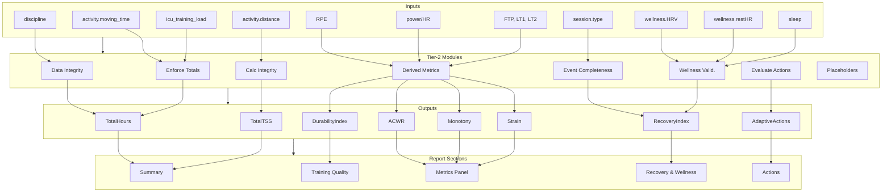

# 🗂 v17 Data Flow Mapping — Inputs to Semantic Outputs

This document defines the **canonical Tier-2 data lineage** for the Intervals.icu GPT Coaching Framework.
All outputs are first assembled into a **semantic JSON structure**, which serves as the single source of truth.
Markdown rendering is a downstream presentation step derived from this JSON.

| Input Data / Field | Source Module | Processed In | Semantic JSON Fields / Outputs | Optional Report Placement | Coaching Frameworks / Actions |
|-------------------|---------------|--------------|--------------------------------|---------------------------|-------------------------------|
| `activity.moving_time` | Intervals.icu API | Tier-2 Step-3: Enforce Event-Only Totals | `totals.total_hours` | Summary (weekly / seasonal) | Foster Monotony/Strain, San Millán |
| `activity.distance` | Intervals.icu API | Tier-2 Step-4: Calculation Integrity | `totals.total_distance` | Summary (weekly / seasonal) | Banister TRIMP, Skiba CP |
| `activity.icu_training_load` | Intervals.icu API | Tier-2 Step-3: Enforce Event-Only Totals | `totals.total_tss` | Summary (weekly / seasonal) | Banister TRIMP, Seiler 80/20 |
| `wellness.HRV` | Intervals.icu API | Tier-2 Step-5: Wellness Validation | `recovery.recovery_index` | Recovery section | San Millán, Banister |
| `wellness.restHR` | Intervals.icu API | Tier-2 Step-5: Wellness Validation | `recovery.recovery_index` | Recovery section | Foster, San Millán |
| `wellness.sleep` | Intervals.icu API | Tier-2 Step-5: Wellness Validation | `recovery.recovery_index` | Recovery section | Foster, Fatigue Index |
| `RPE`, `Feel` | Subjective Input | Tier-2 Step-6: Derived Metrics | `subjective.readiness`, `metabolic.fat_oxidation_index` | Training Quality | Coaching Heuristics |
| `power/HR` | Activity | Tier-2 Step-6: Derived Metrics | `load.acwr`, `load.monotony`, `load.strain`, `intensity.polarisation`, `durability.index` | Metrics Panel | Seiler, Banister, Foster |
| `FTP`, `LT1`, `LT2` | Athlete Profile | Tier-2 Step-6: Derived Metrics | `benchmarks.*` | Seasonal Advanced Markers | Skiba CP, Friel |
| `age` | Athlete Profile | Tier-2 Step-6: Derived Metrics | `context.age_factor_adjusted_atl` | Periodisation / Planning | Friel |
| `activity.climbing` | Activity | Tier-2 Step-6: Derived Metrics | `durability.index` | Training Quality | San Millán |
| `discipline` | Activity | Tier-2 Step-1: Data Integrity | `context.discipline_validated` | Discipline Breakdown | Foster, Cheat Sheet |
| `session.type` | Activity | Tier-2 Step-2: Event Completeness | `calendar.rest_day`, `calendar.current_day` | Summary | Coaching Heuristics |
| Derived `C/R/S` | Tier-2 | Tier-2 Step-4: Calculation Integrity | `load.combined_components` | Metrics Panel | Banister, Seiler |
| All event totals | Tier-2 | Tier-2 Step-4: Calculation Integrity | `audit.variance_checks` | — (audit only) | Audit Flags |
| Audit flags | Tier-0 → Tier-2 | Tier-2 Step-7: Evaluate Actions | `actions.adaptive` | Actions section | `evaluate_actions()` |
| Placeholders `{xxx}` | Semantic Builder | JSON Assembly | `semantic.placeholders` | All sections | Coaching Profile |

**OVERVIEW FLOW DIAGRAM**

> All outputs shown below are first assembled into a semantic JSON structure.
> Report sections consume this JSON and do not derive metrics directly.

**DETAILED SYSTEM FLOW BELOW**

```mermaid
flowchart TD
    %% Inputs and Functions
    activity_moving_time["activity.moving_time"] -->|Processed In| Enforce_Event_Only_Totals
    activity_distance["activity.distance"] -->|Processed In| Calculation_Integrity
    activity_icu_training_load["activity.icu_training_load"] -->|Processed In| Enforce_Event_Only_Totals
    wellness_HRV["wellness.HRV"] -->|Processed In| Wellness_Validation
    wellness_restHR["wellness.restHR"] -->|Processed In| Wellness_Validation
    wellness_sleep["wellness.sleep"] -->|Processed In| Wellness_Validation
    RPE_Feel["RPE, Feel"] -->|Processed In| Derived_Metrics
    power_HR["power/HR"] -->|Processed In| Derived_Metrics
    FTP_LT1_LT2["FTP, LT1, LT2"] -->|Processed In| Derived_Metrics
    age["age"] -->|Processed In| Derived_Metrics
    activity_climbing["activity.climbing"] -->|Processed In| Derived_Metrics
    discipline["discipline"] -->|Processed In| Data_Integrity
    session_type["session.type"] -->|Processed In| Event_Completeness
    derived_CR_S["Derived C/R/S components"] -->|Processed In| Calculation_Integrity
    all_event_totals["All event totals"] -->|Processed In| Calculation_Integrity
    audit_flags["Audit flags"] -->|Processed In| Evaluate_Actions
    placeholders["Placeholders `{xxx}`"] -->|Processed In| Glossary_and_Placeholders

    %% Processing Steps (Modules)
    Enforce_Event_Only_Totals["Tier-2 Step-3: Enforce Event-Only Totals"]
    Calculation_Integrity["Tier-2 Step-4: Calculation Integrity"]
    Wellness_Validation["Tier-2 Step-5: Wellness Validation"]
    Derived_Metrics["Tier-2 Step-6: Derived Metrics"]
    Data_Integrity["Tier-2 Step-1: Data Integrity"]
    Event_Completeness["Tier-2 Step-2: Event Completeness"]
    Evaluate_Actions["Tier-2 Step-7: Evaluate Actions"]
    Glossary_and_Placeholders["Glossary & Placeholders"]

    %% Outputs
    Enforce_Event_Only_Totals -->|Outputs| TotalHours
    Calculation_Integrity -->|Outputs| TotalDistance
    Calculation_Integrity -->|Outputs| TotalTSS
    Wellness_Validation -->|Outputs| RecoveryIndex
    Derived_Metrics -->|Outputs| FatOxidationIndex
    Derived_Metrics -->|Outputs| SubjectiveReadinessIndex
    Derived_Metrics -->|Outputs| ACWR
    Derived_Metrics -->|Outputs| Monotony
    Derived_Metrics -->|Outputs| Strain
    Derived_Metrics -->|Outputs| Polarisation
    Derived_Metrics -->|Outputs| DurabilityIndex
    Derived_Metrics -->|Outputs| HybridMode
    Derived_Metrics -->|Outputs| BenchmarkIndex
    Derived_Metrics -->|Outputs| SpecificityIndex
    Derived_Metrics -->|Outputs| ConsistencyIndex
    Derived_Metrics -->|Outputs| AgeFactor_adjusted_ATL
    Data_Integrity -->|Outputs| ValidatesDatasetSplit
    Event_Completeness -->|Outputs| RestDayIcon
    Event_Completeness -->|Outputs| CurrentDayIcon
    Evaluate_Actions -->|Outputs| AdaptiveActions
    Glossary_and_Placeholders -->|Outputs| PopulatedValues

    %% Render / Report Placement
    TotalHours -->|Render| Weekly_Seasonal_Report_Summary
    TotalDistance -->|Render| Weekly_Seasonal_Report_Summary
    TotalTSS -->|Render| Weekly_Seasonal_Report_Summary
    RecoveryIndex -->|Render| Weekly_Report_Recovery
    FatOxidationIndex -->|Render| Weekly_Seasonal_Report_Training_Quality
    SubjectiveReadinessIndex -->|Render| Weekly_Seasonal_Report_Training_Quality
    ACWR -->|Render| Weekly_Seasonal_Report_Metrics_Panel
    Monotony -->|Render| Weekly_Seasonal_Report_Metrics_Panel
    Strain -->|Render| Weekly_Seasonal_Report_Metrics_Panel
    Polarisation -->|Render| Weekly_Seasonal_Report_Metrics_Panel
    DurabilityIndex -->|Render| Weekly_Seasonal_Report_Training_Quality
    HybridMode -->|Render| Weekly_Seasonal_Report_Metrics_Panel
    BenchmarkIndex -->|Render| Seasonal_Report_Advanced_Markers
    SpecificityIndex -->|Render| Seasonal_Report_Advanced_Markers
    ConsistencyIndex -->|Render| Seasonal_Report_Advanced_Markers
    AgeFactor_adjusted_ATL -->|Render| Seasonal_Report_Periodisation_Load_Planning
    ValidatesDatasetSplit -->|Render| Weekly_Report_Discipline_Breakdown
    RestDayIcon -->|Render| Weekly_Report_Summary_Section
    CurrentDayIcon -->|Render| Weekly_Report_Summary_Section
    AdaptiveActions -->|Render| Weekly_Seasonal_Report_Actions_Section
    PopulatedValues -->|Render| Unified_Reporting_Framework_Sections

    %% Reporting Sections
    Weekly_Seasonal_Report_Summary["Weekly / Seasonal Report – Section Summary"]
    Weekly_Seasonal_Report_Training_Quality["Weekly / Seasonal Report – Training Quality"]
    Weekly_Seasonal_Report_Metrics_Panel["Weekly / Seasonal Report – Metrics Panel"]
    Seasonal_Report_Advanced_Markers["Seasonal Report – Advanced Markers"]
    Seasonal_Report_Periodisation_Load_Planning["Seasonal Report – Periodisation / Load Planning"]
    Weekly_Report_Discipline_Breakdown["Weekly Report – Discipline Breakdown"]
    Weekly_Report_Summary_Section["Weekly Report – Summary Section"]
    Weekly_Seasonal_Report_Actions_Section["Weekly / Seasonal Report – Actions Section"]
    Unified_Reporting_Framework_Sections["Unified Reporting Framework v5.1 sections"]

    %% Relationships between nodes
    Enforce_Event_Only_Totals -->|Contributes to| Weekly_Seasonal_Report_Summary
    Calculation_Integrity -->|Contributes to| Weekly_Seasonal_Report_Summary
    Wellness_Validation -->|Contributes to| Weekly_Report_Recovery
    Derived_Metrics -->|Contributes to| Weekly_Seasonal_Report_Training_Quality
    Data_Integrity -->|Contributes to| Weekly_Report_Discipline_Breakdown
    Event_Completeness -->|Contributes to| Weekly_Report_Summary_Section
    Evaluate_Actions -->|Contributes to| Weekly_Seasonal_Report_Actions_Section
    Glossary_and_Placeholders -->|Contributes to| Unified_Reporting_Framework_Sections
```

