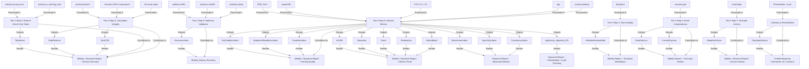

# 🗂 v16.1 Data Flow Mapping — Inputs to Outputs (Enhanced)

| Input Data / Field | Source Module | Processed In | Derived Metrics / Outputs | Render / Report Placement | Coaching Frameworks / Actions |
|-------------------|---------------|--------------|--------------------------|--------------------------|-----------------------------|
| `activity.moving_time` | Intervals.icu API | Tier-2 Step-3: Enforce Event-Only Totals | TotalHours | Weekly / Seasonal Report – Section Summary | Used in **Foster Monotony/Strain**, **San Millán Metabolic Flexibility** |
| `activity.distance` | Intervals.icu API | Tier-2 Step-4: Calculation Integrity | TotalDistance | Weekly / Seasonal Report – Section Summary | Relevant to **Banister TRIMP**, **Skiba Critical Power** |
| `activity.icu_training_load` | Intervals.icu API | Tier-2 Step-3: Enforce Event-Only Totals | TotalTSS | Weekly / Seasonal Report – Section Summary | Affects **Banister TRIMP**, **Seiler 80/20 Polarization** |
| `wellness.HRV` | Intervals.icu API | Tier-2 Step-5: Wellness Validation | RecoveryIndex | Weekly Report – Recovery Section | Relevant to **San Millán Metabolic Flexibility**, **Banister TRIMP** |
| `wellness.restHR` | Intervals.icu API | Tier-2 Step-5: Wellness Validation | RecoveryIndex | Weekly Report – Recovery Section | Impacts **Foster Monotony/Strain**, **San Millán Metabolic Flexibility** |
| `wellness.sleep` | Intervals.icu API | Tier-2 Step-5: Wellness Validation | RecoveryIndex | Weekly Report – Recovery Section | Directly tied to **Foster Monotony/Strain**, **Fatigue Index** |
| `RPE`, `Feel` | Subjective Input | Tier-2 Step-6: Derived Metrics | FatOxidationIndex, SubjectiveReadinessIndex | Weekly / Seasonal Report – Training Quality | Affects **San Millán Metabolic Flexibility**, **Coaching Heuristics** |
| `power/HR` | Activity | Tier-2 Step-6: Derived Metrics | ACWR, Monotony, Strain, Polarisation, DurabilityIndex, FatOxidationIndex, HybridMode | Weekly / Seasonal Report – Metrics Panel | Impacts **Seiler 80/20 Polarization**, **Banister TRIMP**, **Foster Monotony/Strain**, **San Millán Metabolic Flexibility** |
| `FTP`, `LT1`, `LT2` | Athlete Profile / Test | Tier-2 Step-6: Derived Metrics | BenchmarkIndex, SpecificityIndex, ConsistencyIndex | Seasonal Report – Advanced Markers | Linked to **Skiba Critical Power**, **Friel Periodisation** |
| `age` | Athlete Profile | Tier-2 Step-6: Derived Metrics | AgeFactor adjusted ATL | Seasonal Report – Periodisation / Load Planning | Used in **Friel Periodisation** |
| `activity.climbing` | Activity | Tier-2 Step-6: Derived Metrics | DurabilityIndex | Weekly / Seasonal Report – Training Quality | Relevant to **San Millán Metabolic Flexibility** |
| `discipline` | Activity | Tier-2 Step-1: Data Integrity | Validates dataset split (cycling, running, triathlon) | Weekly Report – Discipline Breakdown | Affects **Foster Monotony/Strain**, **Coaching Cheat Sheet** |
| `session.type` | Activity | Tier-2 Step-2: Event Completeness | Assigns “Rest Day 🛌”, “Current Day ⏳” icons | Weekly Report – Summary Section | Influences **Coaching Heuristics**, **Coaching Cheat Sheet** |
| Derived `C/R/S` components | Tier-2 Step-6 | Tier-2 Step-4 Calculation Integrity | Combined load totals | Weekly / Seasonal Report – Metrics Panel | Influences **Banister TRIMP**, **Seiler 80/20 Polarization** |
| All event totals | Tier-2 Step-3 | Tier-2 Step-4 Calculation Integrity | Checks variance vs derived totals | Internal Audit / Compliance Log | Used in **Audit Flags** for **Adaptive Actions** |
| Audit flags | Tier-0 → Tier-2 | Tier-2 Step-7: Evaluate Actions | Adaptive Actions | Weekly / Seasonal Report – Actions Section | Triggered by **`evaluate_actions()`** in **t2_actions.py** |
| Placeholders (`{xxx}`) | Glossary & Placeholders | Used across all modules | Populated values for rendering | Unified Reporting Framework v5.1 sections | Tied to **Coaching Heuristics**, **Coaching Profile** |

```mermaid
%% Compact Vertical Mapping — Optimized for GitHub/VSCodium
%% Top-down layout with small boxes and reduced spacing
flowchart TB
    classDef small fill=#eef,stroke=#99c,stroke-width:1px,font-size:10px,font-family:Arial,rx:4,ry:4;

    subgraph Inputs [Input Sources]
        activity_moving_time["activity.moving_time"]
        activity_distance["activity.distance"]
        activity_icu_training_load["activity.icu_training_load"]
        wellness_HRV["wellness.HRV"]
        wellness_restHR["wellness.restHR"]
        wellness_sleep["wellness.sleep"]
        RPE_Feel["RPE / Feel"]
        power_HR["power / HR"]
        FTP_LT1_LT2["FTP / LT1 / LT2"]
        age["age"]
        activity_climbing["activity.climbing"]
        discipline["discipline"]
        session_type["session.type"]
        derived_CR_S["Derived C/R/S"]
        all_event_totals["Event totals"]
        audit_flags["Audit flags"]
        placeholders["Placeholders {xxx}"]
    end

    subgraph Tier2_Modules [Tier-2 Processing Chain]
        Data_Integrity["Data Integrity"]
        Event_Completeness["Event Completeness"]
        Enforce_Event_Only_Totals["Event Totals Enforcement"]
        Calculation_Integrity["Calculation Integrity"]
        Wellness_Validation["Wellness Validation"]
        Derived_Metrics["Derived Metrics"]
        Evaluate_Actions["Evaluate Actions"]
        Glossary_and_Placeholders["Glossary & Placeholders"]
    end

    subgraph Outputs [Derived Outputs]
        TotalHours["TotalHours"]
        TotalDistance["TotalDistance"]
        TotalTSS["TotalTSS"]
        RecoveryIndex["RecoveryIndex"]
        ACWR["ACWR"]
        Strain["Strain"]
        Monotony["Monotony"]
        Polarisation["Polarisation"]
        DurabilityIndex["DurabilityIndex"]
        FatOxidationIndex["FatOxidationIndex"]
        BenchmarkIndex["BenchmarkIndex"]
        SpecificityIndex["SpecificityIndex"]
        ConsistencyIndex["ConsistencyIndex"]
        HybridMode["HybridMode"]
        AdaptiveActions["AdaptiveActions"]
        ValidatesDatasetSplit["DisciplineSplit"]
    end

    subgraph Report_Sections [Report Rendering]
        Summary["Summary"]
        TrainingQuality["Training Quality"]
        MetricsPanel["Metrics Panel"]
        AdvancedMarkers["Advanced Markers"]
        Periodisation["Periodisation"]
        DisciplineBreakdown["Discipline Breakdown"]
        Recovery["Recovery"]
        Actions["Actions"]
    end

    %% Simplified flow arrows
    Inputs --> Tier2_Modules
    Tier2_Modules --> Outputs
    Outputs --> Report_Sections

    %% Apply compact styling to all nodes
    class Inputs,Tier2_Modules,Outputs,Report_Sections,activity_moving_time,activity_distance,activity_icu_training_load,wellness_HRV,wellness_restHR,wellness_sleep,RPE_Feel,power_HR,FTP_LT1_LT2,age,activity_climbing,discipline,session_type,derived_CR_S,all_event_totals,audit_flags,placeholders,Data_Integrity,Event_Completeness,Enforce_Event_Only_Totals,Calculation_Integrity,Wellness_Validation,Derived_Metrics,Evaluate_Actions,Glossary_and_Placeholders,TotalHours,TotalDistance,TotalTSS,RecoveryIndex,ACWR,Strain,Monotony,Polarisation,DurabilityIndex,FatOxidationIndex,BenchmarkIndex,SpecificityIndex,ConsistencyIndex,HybridMode,AdaptiveActions,ValidatesDatasetSplit,Summary,TrainingQuality,MetricsPanel,AdvancedMarkers,Periodisation,DisciplineBreakdown,Recovery,Actions small;

```

DETAILED SYSTEM FLOW BELOW

```mermaid
flowchart TD
    %% Inputs and Functions
    activity_moving_time["activity.moving_time"] -->|Processed In| Enforce_Event_Only_Totals
    activity_distance["activity.distance"] -->|Processed In| Calculation_Integrity
    activity_icu_training_load["activity.icu_training_load"] -->|Processed In| Enforce_Event_Only_Totals
    wellness_HRV["wellness.HRV"] -->|Processed In| Wellness_Validation
    wellness_restHR["wellness.restHR"] -->|Processed In| Wellness_Validation
    wellness_sleep["wellness.sleep"] -->|Processed In| Wellness_Validation
    RPE_Feel["RPE, Feel"] -->|Processed In| Derived_Metrics
    power_HR["power/HR"] -->|Processed In| Derived_Metrics
    FTP_LT1_LT2["FTP, LT1, LT2"] -->|Processed In| Derived_Metrics
    age["age"] -->|Processed In| Derived_Metrics
    activity_climbing["activity.climbing"] -->|Processed In| Derived_Metrics
    discipline["discipline"] -->|Processed In| Data_Integrity
    session_type["session.type"] -->|Processed In| Event_Completeness
    derived_CR_S["Derived C/R/S components"] -->|Processed In| Calculation_Integrity
    all_event_totals["All event totals"] -->|Processed In| Calculation_Integrity
    audit_flags["Audit flags"] -->|Processed In| Evaluate_Actions
    placeholders["Placeholders `{xxx}`"] -->|Processed In| Glossary_and_Placeholders

    %% Processing Steps (Modules)
    Enforce_Event_Only_Totals["Tier-2 Step-3: Enforce Event-Only Totals"]
    Calculation_Integrity["Tier-2 Step-4: Calculation Integrity"]
    Wellness_Validation["Tier-2 Step-5: Wellness Validation"]
    Derived_Metrics["Tier-2 Step-6: Derived Metrics"]
    Data_Integrity["Tier-2 Step-1: Data Integrity"]
    Event_Completeness["Tier-2 Step-2: Event Completeness"]
    Evaluate_Actions["Tier-2 Step-7: Evaluate Actions"]
    Glossary_and_Placeholders["Glossary & Placeholders"]

    %% Outputs
    Enforce_Event_Only_Totals -->|Outputs| TotalHours
    Calculation_Integrity -->|Outputs| TotalDistance
    Calculation_Integrity -->|Outputs| TotalTSS
    Wellness_Validation -->|Outputs| RecoveryIndex
    Derived_Metrics -->|Outputs| FatOxidationIndex
    Derived_Metrics -->|Outputs| SubjectiveReadinessIndex
    Derived_Metrics -->|Outputs| ACWR
    Derived_Metrics -->|Outputs| Monotony
    Derived_Metrics -->|Outputs| Strain
    Derived_Metrics -->|Outputs| Polarisation
    Derived_Metrics -->|Outputs| DurabilityIndex
    Derived_Metrics -->|Outputs| HybridMode
    Derived_Metrics -->|Outputs| BenchmarkIndex
    Derived_Metrics -->|Outputs| SpecificityIndex
    Derived_Metrics -->|Outputs| ConsistencyIndex
    Derived_Metrics -->|Outputs| AgeFactor_adjusted_ATL
    Data_Integrity -->|Outputs| ValidatesDatasetSplit
    Event_Completeness -->|Outputs| RestDayIcon
    Event_Completeness -->|Outputs| CurrentDayIcon
    Evaluate_Actions -->|Outputs| AdaptiveActions
    Glossary_and_Placeholders -->|Outputs| PopulatedValues

    %% Render / Report Placement
    TotalHours -->|Render| Weekly_Seasonal_Report_Summary
    TotalDistance -->|Render| Weekly_Seasonal_Report_Summary
    TotalTSS -->|Render| Weekly_Seasonal_Report_Summary
    RecoveryIndex -->|Render| Weekly_Report_Recovery
    FatOxidationIndex -->|Render| Weekly_Seasonal_Report_Training_Quality
    SubjectiveReadinessIndex -->|Render| Weekly_Seasonal_Report_Training_Quality
    ACWR -->|Render| Weekly_Seasonal_Report_Metrics_Panel
    Monotony -->|Render| Weekly_Seasonal_Report_Metrics_Panel
    Strain -->|Render| Weekly_Seasonal_Report_Metrics_Panel
    Polarisation -->|Render| Weekly_Seasonal_Report_Metrics_Panel
    DurabilityIndex -->|Render| Weekly_Seasonal_Report_Training_Quality
    HybridMode -->|Render| Weekly_Seasonal_Report_Metrics_Panel
    BenchmarkIndex -->|Render| Seasonal_Report_Advanced_Markers
    SpecificityIndex -->|Render| Seasonal_Report_Advanced_Markers
    ConsistencyIndex -->|Render| Seasonal_Report_Advanced_Markers
    AgeFactor_adjusted_ATL -->|Render| Seasonal_Report_Periodisation_Load_Planning
    ValidatesDatasetSplit -->|Render| Weekly_Report_Discipline_Breakdown
    RestDayIcon -->|Render| Weekly_Report_Summary_Section
    CurrentDayIcon -->|Render| Weekly_Report_Summary_Section
    AdaptiveActions -->|Render| Weekly_Seasonal_Report_Actions_Section
    PopulatedValues -->|Render| Unified_Reporting_Framework_Sections

    %% Reporting Sections
    Weekly_Seasonal_Report_Summary["Weekly / Seasonal Report – Section Summary"]
    Weekly_Seasonal_Report_Training_Quality["Weekly / Seasonal Report – Training Quality"]
    Weekly_Seasonal_Report_Metrics_Panel["Weekly / Seasonal Report – Metrics Panel"]
    Seasonal_Report_Advanced_Markers["Seasonal Report – Advanced Markers"]
    Seasonal_Report_Periodisation_Load_Planning["Seasonal Report – Periodisation / Load Planning"]
    Weekly_Report_Discipline_Breakdown["Weekly Report – Discipline Breakdown"]
    Weekly_Report_Summary_Section["Weekly Report – Summary Section"]
    Weekly_Seasonal_Report_Actions_Section["Weekly / Seasonal Report – Actions Section"]
    Unified_Reporting_Framework_Sections["Unified Reporting Framework v5.1 sections"]

    %% Relationships between nodes
    Enforce_Event_Only_Totals -->|Contributes to| Weekly_Seasonal_Report_Summary
    Calculation_Integrity -->|Contributes to| Weekly_Seasonal_Report_Summary
    Wellness_Validation -->|Contributes to| Weekly_Report_Recovery
    Derived_Metrics -->|Contributes to| Weekly_Seasonal_Report_Training_Quality
    Data_Integrity -->|Contributes to| Weekly_Report_Discipline_Breakdown
    Event_Completeness -->|Contributes to| Weekly_Report_Summary_Section
    Evaluate_Actions -->|Contributes to| Weekly_Seasonal_Report_Actions_Section
    Glossary_and_Placeholders -->|Contributes to| Unified_Reporting_Framework_Sections
```